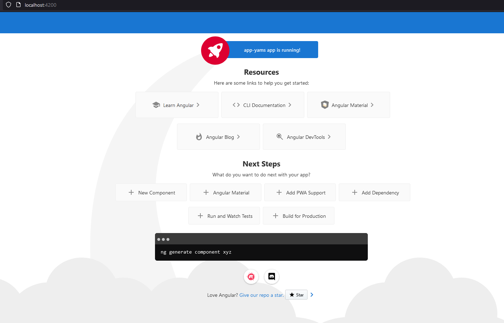
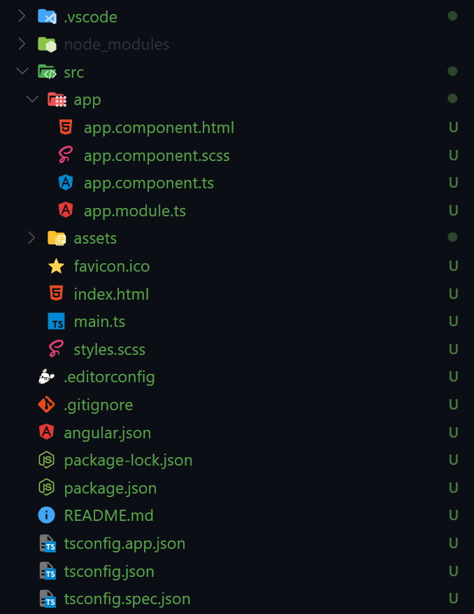

# C'est parti pour créer le projet Angular

## Installation & Configuration d'un Projet Angular

Angular est un framework front-end puissant et flexible, largement adopté pour développer des applications web dynamiques. Pour démarrer rapidement avec Angular, nous utiliserons `angular-cli`, un outil en ligne de commandes très pratique. Voici les étapes détaillées pour installer et configurer un projet Angular :

### 1. **Création d'un Nouveau Projet**

- Avec Angular CLI installé, vous êtes prêt à créer un nouveau projet. Dans votre terminal ou invite de commande, tapez :

  ```bash
  ng new app-yams --style=scss --skip-tests=true --no-standalone
  ```

  Cette commande fait plusieurs choses pour vous :
  - Elle crée un dossier `app-yams`.
  - Elle télécharge et installe le framework Angular et les dépendances nécessaires.
  - Elle configure le projet pour utiliser SCSS comme préprocesseur CSS.
  - Elle omet l'ajout de fichiers de tests unitaires.
  - Elle sera en mode `no-standalone`, c'est pour connecter les components entre eux depuis `app.module.ts`
  
  Si vous souhaitez une configuration standard, sans options supplémentaires, utilisez :

  ```bash
  ng new app-yams
  ```

  **Note**: Pour un projet réel, il est généralement recommandé d'ajouter le routing Angular lors de la création du projet.

### 2. **Lancement du Serveur de Développement**

- Une fois le projet créé, naviguez vers le répertoire du projet :

  ```bash
  cd app-yams
  ```

  Lancez le serveur de développement avec :

  ```bash
  ng serve -o
  ```

  Par défaut, le serveur de développement utilise le port 4200 et le watch mode est activé.

  Ceci compile votre application et lance un serveur de développement. L'option `-o` ouvre automatiquement votre navigateur par défaut à `http://localhost:4200/`.
Vous aurez une page ressemblant à ceci:



  Si vous souhaitez utiliser un port différent, utilisez l'option `--port`. Par exemple, pour utiliser le port 4300 :

  ```bash
  ng serve -o --port 4300
  ```

Vous aurez l'architecture suivante, avec les fichiers suivants:



Détaillons un peu chacun de ces fichiers et dossiers:

1. **.vscode**: Dossier de configuration pour Visual Studio Code, contenant des paramètres spécifiques à l'éditeur pour ce projet.
2. **node_modules**: Dossier contenant toutes les bibliothèques et dépendances nécessaires au projet, installées via npm.
3. **src**: Dossier source contenant le code principal de l'application.
   - **app**: Contient les components, services et modules principaux de l'application.
     - **app.component.html**: Template HTML de la vue du component.
     - **app.component.scss**: Styles SCSS pour le component, ici c'est le component principal.
     - **app.component.ts**: Logique TypeScript pour le component principal.
     - **app.module.ts**: Module principal d'Angular pour l'application, déclarant les components et les modules utilisés.
   - **assets**: Dossier pour stocker les ressources statiques comme les images, les polices, etc.
   - **favicon.ico**: Icône du site affichée dans l'onglet du navigateur.
   - **index.html**: Page principale de l'application, où Angular sera initialisé.
   - **main.ts**: Point d'entrée de l'application Angular, initialisant la plate-forme et démarrant l'application.
   - **styles.scss**: Styles globaux pour l'ensemble de l'application.
4. **.editorconfig**: Fichier de configuration pour assurer une cohérence dans le style d'écriture de code entre différents éditeurs.
5. **.gitignore**: Fichier spécifiant les dossiers et fichiers à ignorer lors de l'utilisation de Git.
6. **angular.json**: Fichier de configuration pour les outils CLI d'Angular.
7. **package-lock.json**: Détaille les versions exactes des dépendances installées.
8. **package.json**: Liste les dépendances du projet et contient diverses métadonnées du projet.
9. **README.md**: Fichier d'information et d'instructions concernant le projet.
10. **tsconfig.app.json**: Configuration TypeScript spécifique à l'application.
11. **tsconfig.json**: Configuration TypeScript principale pour le projet.
12. **tsconfig.spec.json**: Configuration TypeScript pour les tests.

## Installation de Bootstrap

Bootstrap est un framework CSS populaire qui fournit des composants et des styles prêts à l'emploi pour la création d'interfaces utilisateur. Pour l'installer, nous allons utiliser npm, le gestionnaire de paquets de Node.js.

Personnellement, je préfère passer par `pnpm`, mais faites comme vous voulez.

### 1. **Installation de Bootstrap**

- Pour installer Bootstrap, ouvrez votre terminal et tapez :

  ```bash
  npm install bootstrap
  ```

  Cela installera Bootstrap et ses dépendances dans le dossier `node_modules`.

### 2. **Configuration de Bootstrap**

- Pour utiliser Bootstrap dans votre projet, vous devez l'importer dans votre fichier `styles.scss` :

  ```scss
  @import "~bootstrap/scss/bootstrap";
  ```

  Ou alors directement depuis votre fichier `angular.json`:

  ```json
    "styles": [
        "node_modules/bootstrap/scss/bootstrap.scss",
        "src/styles.scss"
    ],
    ```

  Cela importe le fichier SCSS de Bootstrap dans votre fichier `styles.scss`. Vous pouvez maintenant utiliser les classes Bootstrap dans votre application.

  Vous devrez également ajouter les scripts Bootstrap dans votre fichier `angular.json`:

  ```json
    "scripts": [
        "node_modules/bootstrap/dist/js/bootstrap.min.js"
    ]
  ```

    Cela importe les scripts jQuery et Bootstrap dans votre application, des librairies nécessaires pour faire fonctionner Bootstrap correctement.

    Une fois que vous avez fait cela, vous pouvez utiliser Bootstrap dans votre application, mais pour cela, redémarrez le serveur de développement avec `ng serve -o`.
